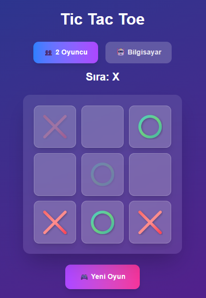

# 🎮 Tic Tac Toe




Modern ve güzel tasarımlı Tic Tac Toe oyunu. Next.js ve TailwindCSS ile geliştirildi.

## ✨ Özellikler

- **Sliding Window Mantığı**: Her oyuncunun maksimum 3 taşı var, 4. taş koyduğunda en eski taş kaybolur
- **Modern Tasarım**: Gradient renkler, gölge efektleri ve animasyonlar
- **SVG İkonlar**: Keskin ve ölçeklenebilir X ve O sembolleri
- **Responsive**: Tüm cihazlarda mükemmel görünüm
- **Türkçe Arayüz**: Tamamen Türkçe kullanıcı deneyimi

## 🚀 Canlı Demo

[Vercel'de Görüntüle](https://tic-tac-toe-nu-bice-81.vercel.app/)

Oynamak isteyenler için: [https://tic-tac-toe-nu-bice-81.vercel.app/](https://tic-tac-toe-nu-bice-81.vercel.app/)

## 🛠️ Teknolojiler

- **Next.js 15** - React framework
- **TypeScript** - Type safety
- **TailwindCSS** - Styling
- **Vercel** - Deployment

## 📦 Kurulum

```bash
# Projeyi klonla
git clone <repo-url>

# Bağımlılıkları yükle
npm install

# Development server'ı başlat
npm run dev
```

## 🎯 Nasıl Oynanır

1. X ile başla
2. Her oyuncunun maksimum 3 taşı var
3. 4. taş koyduğunda en eski taş kaybolur
4. 3 taşını sırayla dizmeyi başaran kazanır!

## 🚀 Deploy

```bash
# Build al
npm run build

# Vercel'e deploy et
vercel --prod
```
