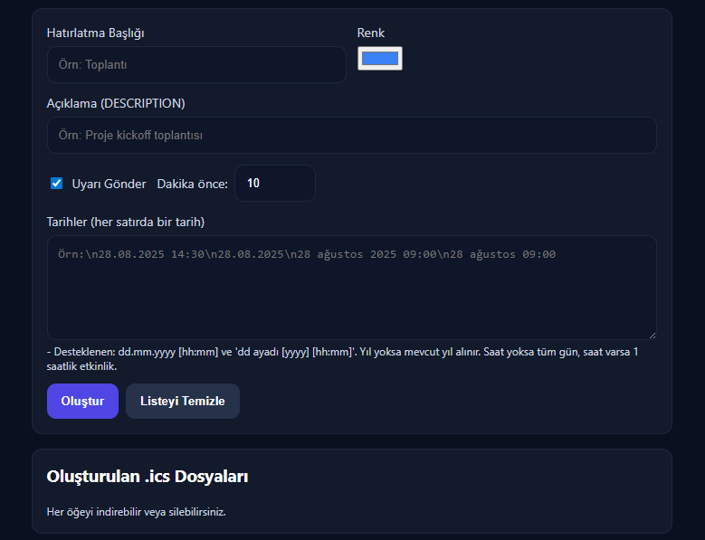

## Takvim .ics Üretici (mailTakvimKaydedici)



Tarayıcıda çalışan, girilen tarihlerden tek tıkla .ics (iCalendar) dosyaları üreten hafif bir araç. Kurulum gerektirmez; sadece `index.html` dosyasını açmanız yeterli.

### Özellikler
- **Hızlı .ics üretimi**: Her satır bir tarih olacak şekilde çoklu girişten birden fazla etkinlik üretir.
- **Türkçe tarih desteği**: "dd.mm.yyyy [hh:mm]", "yyyy-mm-dd [hh:mm]" ve "dd ayadı [yyyy] [hh:mm]".
- **Tüm gün / saatli etkinlik**: Saat yoksa tüm gün; saat varsa varsayılan 1 saatlik etkinlik oluşturur.
- **Açıklama (DESCRIPTION)**: Etkinliğe açıklama ekleyin.
- **Renk ve kategori**: Renk seçimi (Apple Calendar) ve kategori satırı (Outlook/Thunderbird).
- **Uyarı (VALARM)**: X dakika önce bildirim ekleyin.
- **Toplu indirme listesi**: Oluşturulan her .ics için liste, indirme ve silme.
- **Bağımlılık yok**: Sadece HTML/CSS/JS, tamamen yerelde çalışır.

### Hızlı Başlangıç
1) Bu klasörü açın ve `index.html` dosyasını tarayıcıda açın.
2) Başlık, açıklama, renk, uyarı zamanı ve tarih(leri) girin.
3) "Oluştur" butonuna basın; altta .ics dosyalarınız listelenecektir.
4) İstediğinizi indirip takviminize ekleyin.

İsteğe bağlı: Bir yerel sunucuda açmak isterseniz örnekler:

```bash
# Python
python -m http.server 5500

# Node (serve)
npx serve -s . -l 5500
```

### Desteklenen Tarih Formatları

| Biçim | Örnek | Not |
|---|---|---|
| yyyy-mm-dd [hh:mm] | 2025-08-28 14:30 | Saat verilmezse tüm gün |
| dd.mm.yyyy [hh:mm] | 28.08.2025 09:00 | `dd/mm/yyyy` de geçerli |
| dd ayadı [yyyy] [hh:mm] | 28 ağustos 2025 09:00 | Yıl verilmezse mevcut yıl kullanılır |

Türkçe aylar: ocak, şubat, mart, nisan, mayıs, haziran, temmuz, ağustos, eylül, ekim, kasım, aralık (büyük/küçük harf ve Türkçe karakter farklılıkları tolere edilir).

### Kullanım İpuçları
- **Dosya adı**: Başlıktan türetilen "slug" ve tarihle otomatik adlandırılır.
- **Uyarı süresi**: 1–1440 dakika aralığında.
- **Tüm gün etkinlik**: `DTSTART;VALUE=DATE` ve `DTEND;VALUE=DATE` kullanılır (ertesi gün bitiş).
- **Saatli etkinlik**: UTC damgalı `DTSTART/DTEND` kullanılır; süre varsayılan 1 saattir.
- **Renk**: `X-APPLE-CALENDAR-COLOR` ve uyumluluk için `CATEGORIES` satırı eklenir.

### Örnek Giriş

```text
28.08.2025 14:30
28.08.2025
28 ağustos 2025 09:00
2025-08-28 16:45
```

### Teknik Notlar
- Yalnızca `index.html` içinde saf HTML/CSS/JS bulunur; dış bağımlılık yoktur.
- ICS içerikleri RFC 5545 esas alınarak oluşturulur; açıklama/virgül/noktalı virgül gibi karakterler kaçışlanır.
- Zaman dilimi alanı seçimi yoktur; saatli etkinlikler UTC olarak yazılır (takvim uygulamaları yerel saat dilimine uyarlayacaktır).

### Sınırlamalar
- Varsayılan süre saatli etkinlikler için 1 saattir (özelleştirme UI'da yok).
- Tekrarlayan (RRULE) etkinlikler desteklenmez.
- Çok günlük saatli etkinlikler doğrudan desteklenmez (tüm gün seçeneğiyle çalışır).
- Kalıcı kayıt yoktur; liste sayfa yenilenince temizlenir.

### Dağıtım
- Statik dosya olduğu için GitHub Pages, Netlify, Vercel ya da herhangi bir statik sunucuda yayınlanabilir.
- GitHub Pages için: repoyu oluşturun, `index.html` kökte kalsın, Pages'i etkinleştirin.

### Katkı
Öneri ve katkılarınızı memnuniyetle karşılarım. Basit PR'lar veya öneriler iletilebilir.

### Lisans
Lisans henüz belirtilmedi.


