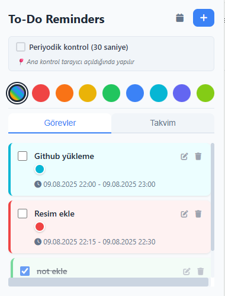
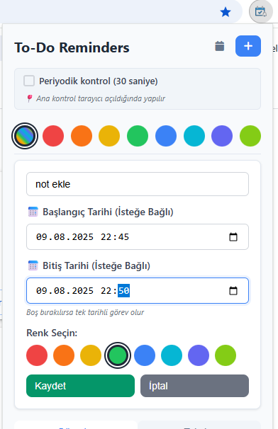
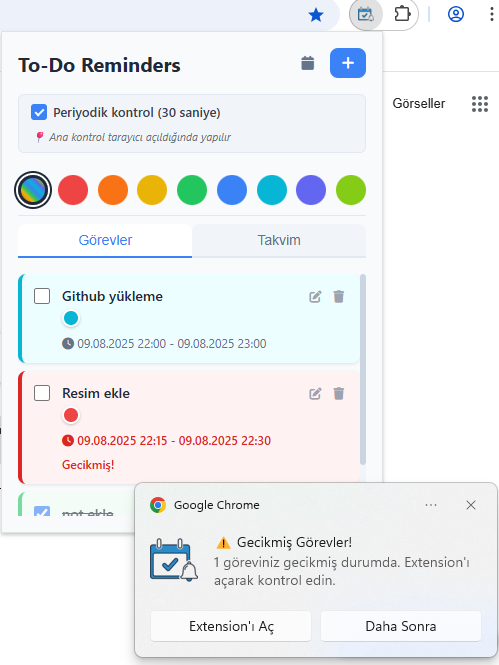

# To-Do Reminders Browser Extension

Modern ve kullanıcı dostu bir görev yönetimi browser extension'ı.




## Özellikler

✅ **CRUD İşlemleri**: Görev ekleme, düzenleme, silme ve tamamlama  
📅 **Tarihli Görevler**: Başlangıç ve bitiş tarihi ile hatırlatma zamanı belirleme  
📅 **Tarih Aralığı**: İki tarih arasındaki görevler (başlangıç - bitiş)
🔔 **Akıllı Bildirimler**: Zamanı gelen görevler için otomatik uyarı  
⚙️ **Kontrol Edilebilir Periyodik Kontrol**: 30 saniye aralıklarla otomatik kontrol (açılıp kapatılabilir)
🎨 **8 Renk Seçeneği**: Kırmızı, turuncu, sarı, yeşil, mavi, turkuaz, lacivert, açık yeşil
🎯 **Renk Filtresi**: Görevleri renklerine göre filtreleyebilme
🗓️ **Takvim Görünümü**: Görevleri renkli noktalarla takvim üzerinde görüntüleme (range ve filter desteği)
🎯 **Modern Tasarım**: Özel CSS ile responsive ve şık arayüz  

## Kurulum

1. Bu dosyaları bir klasöre indirin
2. Chrome tarayıcıda `chrome://extensions/` adresine gidin
3. "Geliştirici modu"nu aktif edin (sağ üst köşe)
4. "Paketlenmemiş uzantı yükle" butonuna tıklayın
5. Proje klasörünü seçin

## Kullanım

### Görev Ekleme
- `+` butonuna tıklayın
- Görev metnini girin
- İsteğe bağlı **başlangıç** tarih/saat belirleyin
- İsteğe bağlı **bitiş** tarih/saat belirleyin (tarih aralığı için)
- 8 renkten birini seçin (varsayılan: yeşil)
- "Kaydet" butonuna tıklayın

### Görev Yönetimi
- ✅ Checkbox ile görev tamamlama
- ✏️ Düzenleme butonu ile görev güncelleme
- 🗑️ Silme butonu ile görev silme

### Renk Filtresi
- Header'daki renk butonlarından birini seçin
- Sadece o renkteki görevler gösterilir
- "Tümü" butonu ile tüm görevleri görebilirsiniz  
- Filtreleme hem görev listesinde hem takvimde çalışır
- Yeni görev eklerken farklı renk seçerseniz otomatik o renge geçer

### Takvim Görünümü
- "Takvim" sekmesine tıklayın
- Renkli noktalar seçtiğiniz renkleri gösterir:
  - 🔴 Kırmızı, 🟠 Turuncu, 🟡 Sarı, 🟢 Yeşil
  - 🔵 Mavi, 🔵 Turkuaz, 🟣 Lacivert, 🟢 Açık Yeşil
- Aktif renk filtresi takvimde de uygulanır

### Hatırlatmalar
- Tarihli görevler için otomatik bildirim
- "Tamamlandı" veya "Daha Sonra" (10 dk) seçenekleri
- Gecikmiş görevler için özel uyarı

### Otomatik Kontrol Sistemi
- **Ana Kontrol**: Tarayıcı açıldığında otomatik kontrol (browser startup)
- **Popup Kontrol**: Extension açıldığında hafif kontrol (son 5 dakikada due olanlar)
- **Periyodik Kontrol**: Checkbox ile 30 saniyede bir kontrol (opsiyonel)
- **Tab Fokus**: Her iki durumda da tab'a dönüldüğünde kontrol
- Ayar otomatik kaydedilir

## Teknik Detaylar

- **Manifest V3** browser extension
- **localStorage** ve **chrome.storage** veri saklama
- **chrome.alarms** API ile zamanlanmış hatırlatmalar
- **chrome.notifications** API ile sistem bildirimleri
- **Modern CSS** ile şık tasarım
- **Vanilla JavaScript** - framework bağımlılığı yok

## Dosya Yapısı

```
├── manifest.json       # Extension konfigürasyonu
├── popup.html         # Ana arayüz
├── popup.css          # Modern CSS stilleri
├── popup.js           # Frontend mantığı
├── background.js      # Servis worker
└── icons/             # Icon dosyaları
    ├── icon-16.png
    ├── icon-48.png
    └── icon-128.png
```

## Geliştirici Notları

- Veriler hem localStorage hem chrome.storage'da tutulur
- Background service worker alarm ve bildirimleri yönetir  
- 8 renkli kategori sistemi (priority sistemi kaldırıldı)
- **Tarih Aralığı Sistemi**: Başlangıç ve bitiş tarihi desteği
- Calendar'da date range gösterimi (range içindeki her gün)
- Overdue kontrolü: bitiş tarihi varsa ona göre, yoksa başlangıç tarihine göre
- **Renk Filtreleme Sistemi**: 8 renk + "Tümü" seçenekleri
- Filtreleme hem todos hem calendar view'da çalışır
- Smart filter switching: yeni görev farklı renkte ise otomatik geçiş
- Otomatik migration: eski todo'lara varsayılan renk eklenir
- **Opsiyonel periyodik kontrol**: Kullanıcı tercihine göre 30s interval
- Visibility API kullanımı: Tab fokusunda otomatik kontrol
- Modern CSS Grid ve Flexbox kullanımı
- Responsive tasarım (380x500px popup)
- Smooth hover animasyonları ve renk geçişleri
- Custom scrollbar styling
- Türkçe dil desteği

## Lisans

MIT License 